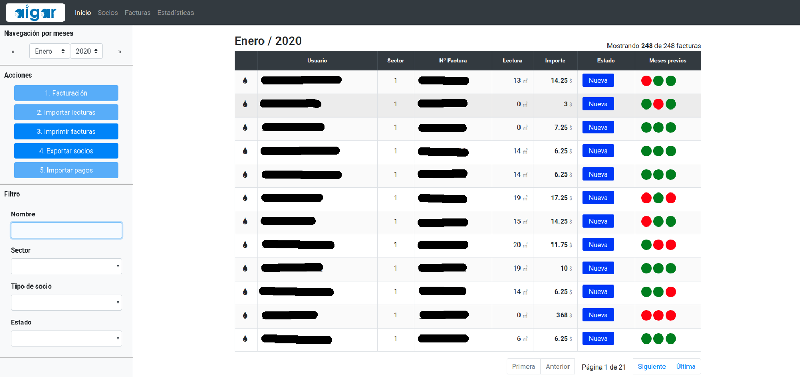

AIGAR: Aplicación Innovadora para la Gestión de Agua Rural

AIGAR es una aplicación desarrollada por [iCarto](https://icarto.es/) en colaboración con [Ingeniería Sin Fronteras Cataluña](https://esf-cat.org/) y [ACUA](http://acua.org.sv/).

AIGAR está financiado por la AGENCIA ESPAÑOLA DE COOPERACIÓN INTERNACIONAL PARA EL DESARROLLO, [AECID](https://www.aecid.es), a través del proyecto “Aplicación de soluciones integrales e innovadoras para la sostenibilidad y buena gestión de los sistemas comunitarios de agua en El Salvador”, presentado a la convocatoria de Acciones de Cooperación Para el Desarrollo correspondiente al año 2018 para la Realización de Proyectos de Innovación para el Desarrollo.

Este repositorio contiene la aplicación web (empaquetada para escritorio a través de Electron) de AIGAR. AIGAR permite a las Juntas Administradoras de los sistemas de Agua Potable y Saneamiento rurales (Juntas de agua) la gestión administrativa del sistema. Incluye la gestión del catastro de personas socias de la Junta de Agua, y todo el proceso de facturación con las siguientes funcionalidades:

-   Consumo y Facturación
-   Importar lecturas de medidores
-   Importar registros de pago bancarios
-   Catastro de personas socias
-   Estadísticas de consumos, moras, ...

La aplicación en este momento está muy ligada a la forma de trabajo de ASCATLI, la Junta de Agua que se ha escogido como piloto para este proyecto. El sistema de agua que administra ASCATLI tiene alrededor de 250 socias y comprende las comunidades de Tihuapa Norte y Tlacuxtli, en el municipio del Puerto de la Libertad en El Salvador.

Puedes descargar y probar la aplicación desde el [apartado de relases](https://gitlab.com/icarto/aigar/-/relases). Llega con descomprimir el zip y hacer doble click en el fichero `AIGAR.exe`. La aplicación contiene una base de datos vacía.

La [aplicación de escritorio](https://gitlab.com/icarto/aigar) se complementa con [aigar-lecturas](https://gitlab.com/icarto/aigar-lecturas) una aplicación móvil para tomar en campo las lecturas de los medidores de agua de las viviendas. A pesar de empaquetarse como una aplicación de escritorio está concebida para poder ser desplegada en un servidor web de modo que pueda ser usada por usuarios con diferentes roles, una asociación de juntas de agua que de soporte a varias, ...

Ambas aplicaciones son libres (licencia AGPL) y gratuitas.

Si eres una ONG y estás planteándote usar algo similar en tu proyecto puedes escribir a [iCarto](https://icarto.es/contacta/), [ISF-Cataluña](https://esf-cat.org/es/contacta/) o [ACUA](http://acua.org.sv/index.php/contactenos) para hablar sobre la identificación del proyecto, buenas prácticas, posibles problemas o lo que necesites.

# Capturas

